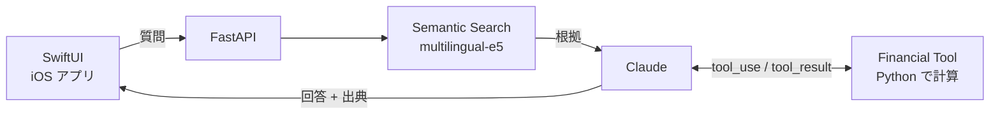

<div align="center">

# investment-research-copilot

決算資料を根拠に答える、SwiftUI と Claude の AI リサーチアプリ

[](LICENSE)


</div>

決算 PDF について質問すると、関連する箇所を検索し、その箇所だけを根拠に回答と出典（ページ）を返します。成長率などの計算は LLM ではなく Python で行い、資料に根拠がない質問には答えません。

> [!IMPORTANT]
> 学習・研究目的のプロジェクトです。投資助言や株価予測は行いません。

## 構成



| 工夫した点 | 内容 |
| --- | --- |
| 計算を LLM にさせない | Claude は「計算が必要か」だけを判断し、計算は Python のツールで行う |
| 出典を捏造させない | Claude が返した出典を、実際の検索結果と照合してから表示する |
| 失敗を切り分けられる | 検索・回答・出典を別々の指標で評価する |
| API キーを端末に置かない | キーはバックエンドのみに置き、iOS アプリには持たせない |

## 評価

| 指標 | mvp-baseline |
| --- | ---: |
| Recall@5（正解 chunk が検索結果にある） | 92% |
| Page Recall@5 | 100% |
| Answer Accuracy | 93% |
| Source Match Rate | 93% |
| Source 付与率（答えた回答に検証済み出典がある） | 100% |
| ツール選択の正しさ | 97% |
| レイテンシ p50 / p95 | 3.7 s / 9.1 s |
| コスト | 未測定（30 問で入力 153,182 / 出力 6,377 トークン） |

## 使用技術

| 分野 | 技術 |
| --- | --- |
| iOS | Swift / SwiftUI / Swift Concurrency / URLSession（ストリーミング受信） |
| バックエンド | Python / FastAPI / Pydantic / pytest |
| AI | Claude API（構造化出力・Tool Calling・ストリーミング） / Sentence Transformers（multilingual-e5-small） / RAG |
| データ | pypdf / NumPy |

## ディレクトリ構成

| ディレクトリ | 内容 |
| --- | --- |
| `ios/` | iOS アプリ（`ResearchCopilot.xcodeproj`） |
| `backend/src/research_copilot/` | バックエンド。`api`（FastAPI）・`agent`（検索・Claude・ツールをつなぐ中心の処理）・`retrieval`（検索）・`tools`（財務計算）・`extraction`（構造化抽出）・`evaluation` |
| `backend/tests/` | バックエンドのテスト |
| `data/` | 決算資料のメタデータと、検索用に加工したデータ |
| `evaluation/` | 評価データと評価結果 |
| `docs/` | 評価指標の説明など |

B1〜B8 の学習過程は [`bootcamp-final`](https://github.com/yossibank/investment-research-copilot/tree/bootcamp-final) タグで見られます。

## 動かし方

1. `python -m venv .venv && source .venv/bin/activate && python -m pip install -e "backend[dev]"` で依存パッケージを入れる
2. `cp .env.example .env` で `ANTHROPIC_API_KEY` と `ANTHROPIC_MODEL` を設定する
3. `fastapi dev backend/src/research_copilot/api/main.py` でバックエンドを起動する
4. `ios/ResearchCopilot.xcodeproj` を開き、シミュレータで実行する

<details>
<summary>決算資料の準備</summary>

決算 PDF は Git に含めていません。`data/raw/filing.pdf` に置き、次の順に検索用データを作ります。

```sh
python -m research_copilot.retrieval.pdf_reader   # PDF → ページごとのテキスト
python -m research_copilot.retrieval.chunking     # テキスト → チャンク
python -m research_copilot.retrieval.embeddings   # チャンク → 埋め込み
```

</details>

<details>
<summary>テストと評価</summary>

```sh
python -m pytest backend
python -m research_copilot.evaluation.evaluator --limit 1   # API を呼ぶので少ない件数から
```

</details>
